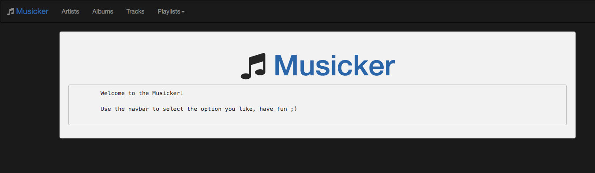

# THE-MUSICKER

> `Project` exercise for project javascript RESTful API and SQLite CRUD operations with a client web interface.

## Table of contents
* [General info](#general-info)
* [Screenshots](#screenshots)
* [Technologies](#technologies)
* [Setup](#setup)
* [Features](#features)
* [Status](#status)
* [Contact](#contact)

## General info
The purpose of the project is to build an interface for the navigation of the artists, albums, tracks and playlists from the `db/chinook.sqlite` sqlite database file, the users can create and edit the playlists with the client provided. [development-strategy.md](./development-strategy.md) file contains the steps used to complete this project, it describes the branches with details about the what is implemented.

## Screenshots

## Technologies

* javascript
* express
* SQLite

## Setup
You can clone or fork this repository and test the files.

## Features
The project features a web site with:
* Functionalities described in [user-stories.md](./user-stories.md)

## Status
Project is: finished, final version.

## Contact
Created by [@ferrycosv](www.github.com/ferrycosv) - feel free to contact me!